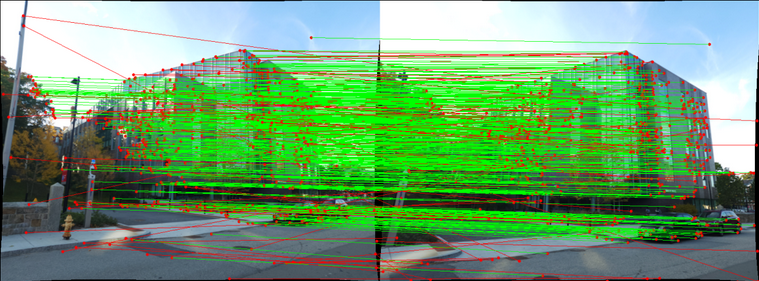

# Structure from Motion (SfM) and Neural Radiance Fields (NeRF)


This repository contains the implementation of the Structure from Motion (SfM) and Neural Radiance Fields (NeRF) projects.

## Project Overview:

The implementation of SFM and NeRF is in two phases:

## Phase 1 - Classical Structure from Motion (SfM) Pipeline : 

This phase involves reconstructing a 3D scene and obtaining poses of the monocular camera using classical SfM techniques. The main steps include feature matching, estimating the fundamental matrix, essential matrix, camera pose, triangulation, and bundle adjustment.

The classical structure from motion (SfM) pipeline is implemented using the below steps:

* ``` Feature_matching:``` Extract SIFT features and match across images
* ``` Fundamental_matrix:``` Estimate fundamental matrix with RANSAC outlier rejection
* ``` Essential_matrix:``` Compute essential matrix from fundamental matrix
* ``` Camera_pose:``` Extract relative camera pose from the essential matrix
* ``` Triangulation:``` Linear and nonlinear triangulation of 3D points
* ``` pnp:``` Perspective-n-Point camera pose estimation
* ``` Bundle_adjustment:``` Bundle adjustment to refine camera poses and 3D points
* ``` Visiblity_matrix:``` Construct visibility matrix between cameras and points
* ``` wrapper.py:``` Main script to run the entire SfM pipeline

### Input:
The data given to us is a set of 5 images of Unity Hall at WPI, using a Samsung S22 Ultra’s primary camera at f/1.8 aperture, ISO 50 and 1/500 sec shutter speed.


The data folder contains 4 matching files named matching*.txt where * refers to numbers from 1 to 5. For eg., matching3.txt contains the matching between the third image and images that come after, i.e., I3↔I4,I3↔I5. This is the reason image 5 does not have a text file.

<br>

### Initial Feature matching


<br>

### Outlier Rejectiong - RANSAC (using Fundamental matrix)


### Cheirality check


### Triangulation(1 & 2) using Correct Camera pose


### After Perspective-n-Point and Bundle Adjustment


### Usage Guidelines:

1. To Execute the SFM pipeline run the below code:
```
python3 Wrapper.py
```

#### Outputs:

I have provided detailed re-projection error analysis, including tables and images, after each step of the SfM pipeline in the report. This includes results for linear and non-linear triangulation, linear and non-linear PnP before and after bundle adjustment, and more.

#### Input and Output Data

1. The save path location and Data path can be changed in Arg-Parser

<br>

## Phase 2 - Neural Radiance Fields (NeRF):

This phase focuses on implementing the NeRF algorithm, allowing us to synthesize novel views of 3D scenes using deep learning. NeRF represents a scene as a continuous volumetric function and can generate photorealistic views. Implementation is of the original NERF method [from this paper](https://arxiv.org/abs/2003.08934).

### Input:
Download the lego data for NeRF from the original author’s link [here](https://drive.google.com/drive/folders/1lrDkQanWtTznf48FCaW5lX9ToRdNDF1a)

#### Sample input


### Training


### Test Result


### Usage Guidelines:

#### Training:
1. Switch to the Phase 2 directory.
2. Train the NeRF model on GPU by executing the below code:

```
python3 NeRF_train.py
```
3. The final Loss plot is saved in the Results folder.

#### Testing
1. Switch to the Phase 2 directory.
2. Test the NeRF model by executing the below code:

```
python3 NeRF_test.py
```
3. The final video is saved in the same directory.


## References:

1. https://arxiv.org/abs/2003.08934
2. https://rbe549.github.io/fall2022/proj/p3/


